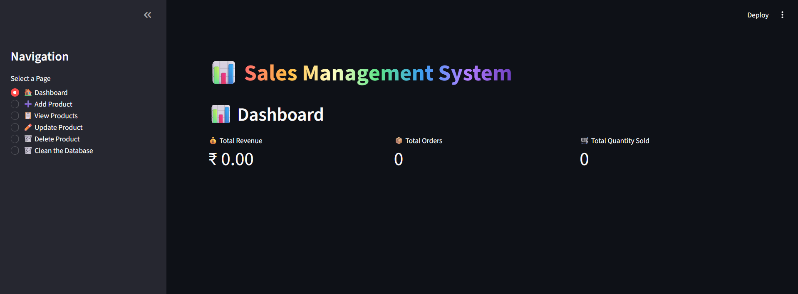
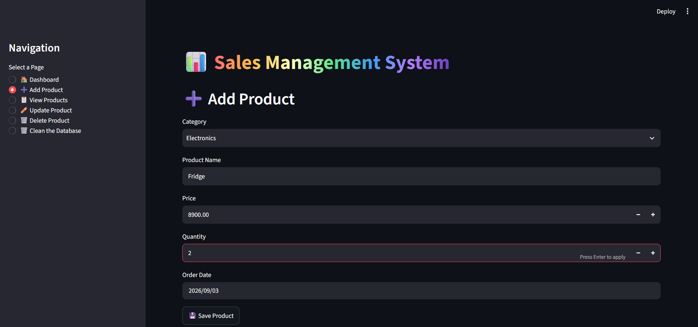
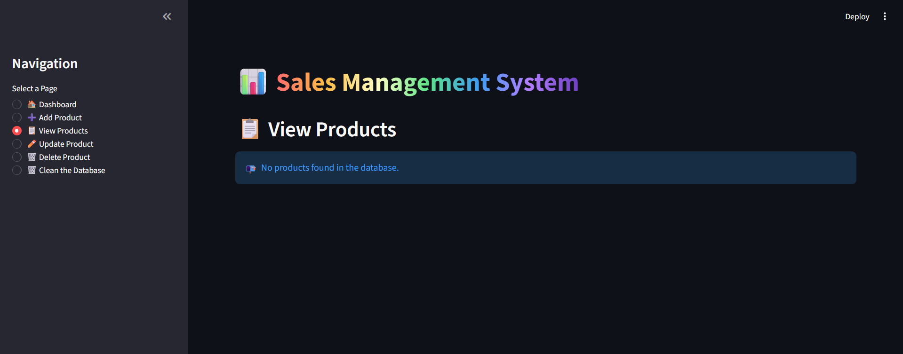
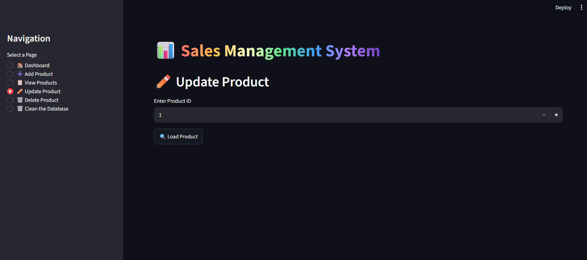
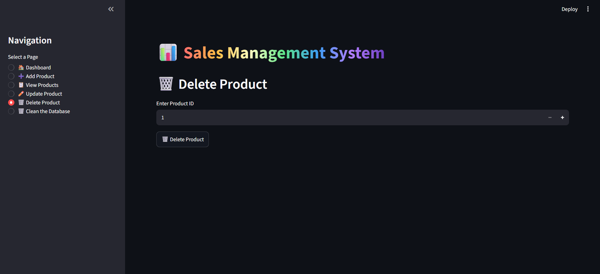
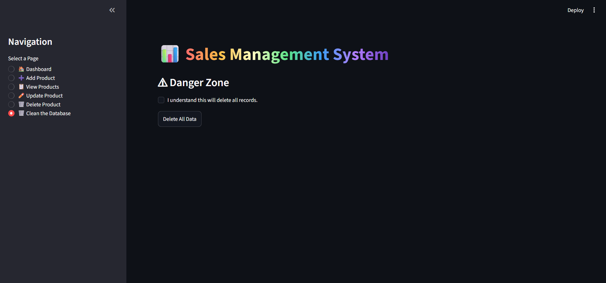

# 📦 Sales & Inventory Management System

<p align="center">
  <strong>A web-based Sales & Inventory Management System built with Python, Streamlit, and Microsoft SQL Server.</strong>
</p>

<p align="center">
  
  
  
  
</p>

---

## 📌 About the Project

The **Sales & Inventory Management System** is a Python-based web application developed using **Streamlit** with **Microsoft SQL Server** as the backend database.

The application provides an easy-to-use interface for managing product and inventory information while demonstrating practical database connectivity and CRUD operations.

---

## ✨ Features

* 🏠 **Home Page** — Application overview and navigation
* 📦 **Product Management** — Manage product information
* ➕ **Add Products** — Add new product records
* 👀 **View Products** — Display stored product information
* ✏️ **Update Products** — Modify existing product records
* 🗑️ **Delete Products** — Remove unwanted records
* 🗄️ **SQL Server Integration** — Store and manage data using SQL Server
* 🔌 **Database Connectivity** — Connect Python application with SQL Server using PyODBC
* 🌐 **Streamlit Interface** — Simple and interactive web-based UI

---

## 🛠️ Tech Stack

| Technology               | Usage                            |
| ------------------------ | -------------------------------- |
| 🐍 Python                | Application development          |
| 🎈 Streamlit             | Web application & user interface |
| 🗄️ Microsoft SQL Server | Backend database                 |
| 🔌 PyODBC                | Database connectivity            |
| 📊 Pandas                | Data manipulation & handling     |
| 📓 Jupyter Notebook      | Data exploration / development   |

---

## 🏗️ Application Architecture

```text
                    👤 User
                      │
                      ▼
              ┌───────────────┐
              │   Streamlit   │
              │  Web Interface│
              └───────┬───────┘
                      │
                      ▼
              ┌───────────────┐
              │     Python    │
              │   Application │
              └───────┬───────┘
                      │
                      ▼
              ┌───────────────┐
              │    PyODBC     │
              │   Connection  │
              └───────┬───────┘
                      │
                      ▼
              ┌───────────────┐
              │ Microsoft SQL │
              │     Server    │
              └───────────────┘
```

---

## 📂 Project Structure

```text
Sales_inventory_System/
│
├── app.py
├── sales.py
├── machine.ipynb
├── README.md
├── .gitignore
│
└── Snippts/
    ├── Home_page.png
    ├── clean_page.png
    ├── delete_page.png
    ├── product_page.png
    ├── product_view.png
    └── update_page.png
```

---

# 📸 Application Screenshots

## 🏠 Home Page



## 📦 Product Management



## 👀 Product View



## ✏️ Update Product



## 🗑️ Delete Product



## 🧹 Clean Page



---

# ⚙️ Installation & Setup

### 1️⃣ Clone the Repository

```bash
git clone https://github.com/mohdrazi-analytics/Sales_inventory_System.git
```

### 2️⃣ Navigate to the Project

```bash
cd Sales_inventory_System
```

### 3️⃣ Install Required Libraries

```bash
pip install -r requirements.txt
```

### 4️⃣ Configure SQL Server

Make sure **Microsoft SQL Server** is installed and running on your system.

Configure your database connection according to your local SQL Server environment.

> 🔐 Never upload database passwords, credentials, or other sensitive information to GitHub.

### 5️⃣ Run the Application

```bash
streamlit run app.py
```

The application will open in your browser.

---

# 🗄️ Database

The project uses **Microsoft SQL Server** as the backend database.

The Python application communicates with SQL Server through **PyODBC**, allowing the Streamlit interface to perform database operations.

---

# 🎯 Learning Outcomes

This project demonstrates practical experience with:

* Python application development
* Streamlit web applications
* SQL Server database management
* CRUD operations
* Database connectivity using PyODBC
* Data manipulation using Pandas
* Git & GitHub version control
* Building a database-driven application

---

# 🚀 Future Improvements

Potential improvements for future versions:

* 🔐 User authentication and authorization
* 📊 Advanced analytics dashboard
* 📈 Sales and inventory visualizations
* 🔎 Advanced search and filtering
* 📤 Export data to Excel/CSV
* ☁️ Cloud database deployment
* 🌐 Deploy the Streamlit application online
* 📱 Improve responsive UI/UX

---

# 👨‍💻 Author

## Mohd Razi

**📊 Data Analyst → Data Engineer**

Passionate about working with data, solving business problems, building data-driven applications, and developing practical data engineering solutions.

### 🛠️ Skills

**SQL • Power BI • DAX • Python • Pandas • Streamlit • SQL Server • Microsoft Fabric**

---

<p align="center">
  ⭐ If you found this project useful, consider giving it a star!
</p>
